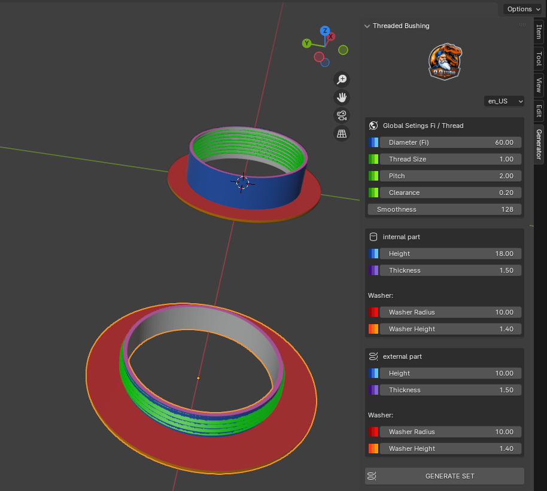

  
  <h1>Threaded Bushing Generator</h1>

  

    <strong>A professional parametric tool for Blender to generate threaded bushings, bolts, nuts, and washers.</strong>
  

  

    
    
    
  

---

## 📖 Overview

**Threaded Bushing Generator** is a lightweight yet powerful Blender add-on designed for 3D modelers, engineers, and designers. It allows for the rapid creation of mechanical parts with precise control over geometry.

Stop modeling threads manually! Generate complex mechanical assemblies with a single click.

## 📸 Gallery

  
<strong>👁️ Click here to view screenshots</strong>

   
  
  <table>
    <tr>
      <td align="center">
        
         <em>Screen 01</em>
      </td>
    </tr>
  </table>

## ✨ Features

* **Parametric Generation:** Adjust radius, height, thickness, and smoothness (segments).
* **Advanced Thread Control:**
    * Customizable Thread Size.
    * Adjustable Pitch (distance between threads).
    * Clearance settings (essential for 3D printing tolerances).
* **Washer Integration:** Built-in washer generator with adjustable radius and height.
* **Multi-Language Support:** The interface automatically adapts to your preferred language or can be switched manually.
* **Material Presets:** Generates objects with predefined vertex colors/materials for better visualization.

## 🌍 Supported Languages

The add-on features a dynamic CSV-based translation system (`lang.csv`). Currently supported:

* 🇺🇸 English (Default)
* 🇵🇱 Polski (Polish)
* 🇩🇪 Deutsch (German)
* 🇫🇷 Français (French)
* 🇪🇸 Español (Spanish)
* 🇨🇳 中文 (Chinese Simplified)
* 🇸🇦 العربية (Arabic)

*(You can easily add your own language by editing the CSV file!)*

## 🚀 Installation

1.  Download the **ZIP file** from the [Releases](https://github.com/oqstudio/Threaded-Bushing-Generator/releases) page (or download this repo as ZIP).
2.  Open Blender.
3.  Go to **Edit > Preferences > Add-ons**.
4.  Click **Install...** (or "Install from Disk" in Blender 4.2+).
5.  Select the downloaded ZIP file.
6.  Enable the add-on by checking the box next to **"Mesh: Threaded Bushing Generator"**.

## 🛠️ Usage

1.  Open the **3D Viewport**.
2.  Press `N` to open the Sidebar.
3.  Click on the **Generator** tab.
4.  Adjust the parameters (Radius, Thread Pitch, etc.).
5.  Select your language from the dropdown menu (optional).
6.  Click **GENERATE SET**.

## 🤝 Contributing

Contributions are welcome! If you want to add a new language or improve the code:

1.  Fork the repository.
2.  Edit `lang.csv` (use UTF-8 encoding!) or modify `__init__.py`.
3.  Submit a Pull Request.

## 📄 License

Distributed under the **GPL-3.0 License**. See `LICENSE` for more information.

---

  Created by <strong>OQStudio</strong>

